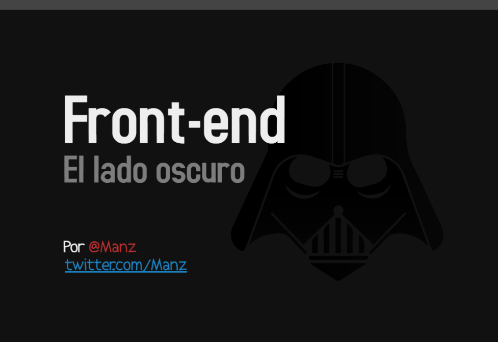

## Front-end: El lado oscuro

Charla para el II Congreso de Informática de la Universidad de La Laguna
[http://cesinf.webs.ull.es/](http://cesinf.webs.ull.es/)

## Referencias

Framework utilizado para crear la presentación: [Impress.js](https://github.com/impress/impress.js)

### HTML/CSS

HTML4: [https://www.w3.org/TR/1999/REC-html401-19991224/index/elements.html](https://www.w3.org/TR/1999/REC-html401-19991224/index/elements.html)
Etiqueta <blink>: [https://encrypted.google.com/search?q=blink+tag](https://encrypted.google.com/search?q=blink+tag)
XHTML1: [https://www.w3.org/TR/xhtml1/](https://www.w3.org/TR/xhtml1/)
HTML5: [https://www.w3.org/TR/html5/](https://www.w3.org/TR/html5/)
HTML5.1: [https://www.w3.org/TR/2016/CR-html51-20160621/](https://www.w3.org/TR/2016/CR-html51-20160621/)
[Ejemplo CodePen: Animaciones CSS / Web Animation](https://codepen.io/manz/pen/xOGNRP)
[Ejemplo CodePen: Flexbox](https://codepen.io/manz/pen/BzoYKb)
CanIUse (Soporte en navegadores): [http://caniuse.com/](http://caniuse.com/)

### Preprocesadores

NodeJS/NPM: [https://nodejs.org/es/](https://nodejs.org/es/) / [https://www.npmjs.com/](https://www.npmjs.com/)
PugJS (Preprocesador HTML, antiguamente Jade): [https://pugjs.org/](https://pugjs.org/)
LESS (Preprocesador CSS): [http://lesscss.org/](http://lesscss.org/)
BabelJS (Transpiler JSES6 -> JSES5): [https://babeljs.io/](https://babeljs.io/)
Tabla de compatibilidad con ES5/6/7: [ES6 Kangax Compat-table](http://kangax.github.io/compat-table/es6/)

Benchmark CSS: [https://goalsmashers.github.io/css-minification-benchmark/](https://goalsmashers.github.io/css-minification-benchmark/)
Minificador CSS: [https://github.com/jakubpawlowicz/clean-css](https://github.com/jakubpawlowicz/clean-css)
Minificador JS: [https://github.com/mishoo/UglifyJS2](https://github.com/mishoo/UglifyJS2)
Minificador HTML: [https://github.com/jserme/htmlmin](https://github.com/jserme/htmlmin)

### PostCSS

Transformación de CSS con JS: [http://postcss.org/](http://postcss.org/)
Plugins para PostCSS: [http://postcss.parts/](http://postcss.parts/)

### SVG

Scalable Vector Graphics: [https://www.w3.org/Graphics/SVG/](https://www.w3.org/Graphics/SVG/)
SVG Optimizer: [https://github.com/svg/svgo](https://github.com/svg/svgo)

### Atom

Atom Editor: [https://atom.io/](https://atom.io/)
Paquete Atom para procesar LESS con PostCSS automáticamente: [https://atom.io/packages/less-postcss-autocompile](https://atom.io/packages/less-postcss-autocompile)

### Task Runners

GruntJS: [http://gruntjs.com/](http://gruntjs.com/)
GulpJS: [http://gulpjs.com/](http://gulpjs.com/)
Plugins GulpJS: [http://gulpjs.com/plugins/](http://gulpjs.com/plugins/)
BroccoliJS: [http://broccolijs.com/](http://broccolijs.com/)

### Contacto
[http://twitter.com/Manz](http://twitter.com/Manz)
[http://www.emezeta.com/](http://www.emezeta.com/)
